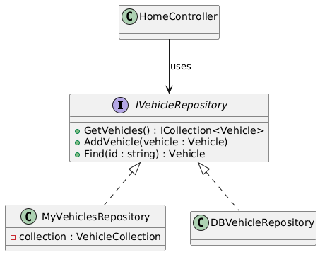
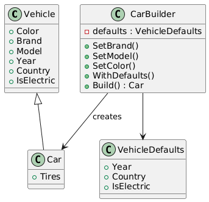
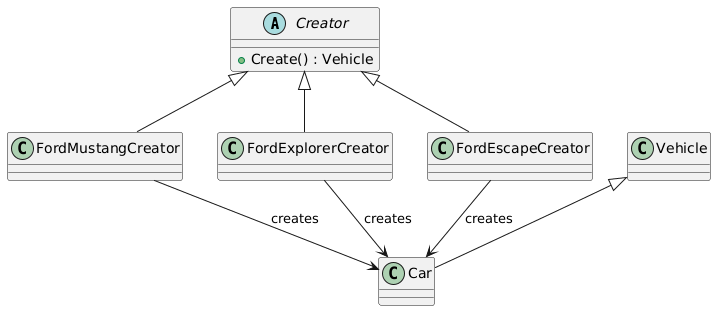
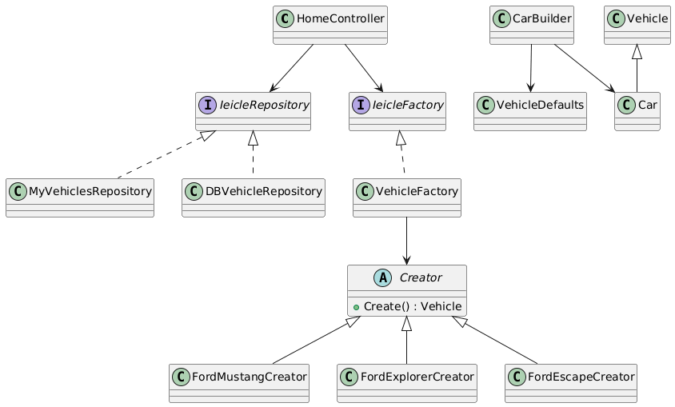

# 🚗 Best Practices – SOLID & Design Patterns: Taller Formativo

Este proyecto corresponde a la **Tarea 12** del curso de **Ing. Web**. El objetivo de este taller es reforzar la aplicación práctica de los **Principios SOLID** y **Patrones de Diseño** en una aplicación web desarrollada con **ASP.NET Core MVC**.

El escenario del taller simula un entorno real de trabajo, donde intervienen distintos equipos (QA, Base de Datos, Negocio y Arquitectura), cada uno con requerimientos y restricciones específicas.

---

## 🎯 Objetivo del Taller

- Aplicar **Principios SOLID** en un proyecto existente.
- Implementar **Patrones de Diseño** para resolver problemas reales de mantenibilidad y escalabilidad.
- Diseñar una solución preparada para:
  - Cambios futuros en el modelo de negocio
  - Migración de persistencia (InMemory → Base de Datos)
  - Integración con una aplicación web moderna (Next.js)

---

## 🧩 Escenario del Problema

Durante la gestión del proyecto se presentaron los siguientes requerimientos:

- Los métodos para agregar vehículos no funcionaban correctamente.
- El esquema de base de datos aún no estaba listo.
- El negocio solicitó agregar propiedades por defecto (año actual y +20 propiedades futuras).
- Se planea introducir nuevos modelos de vehículos.
- Se proyecta una migración futura hacia una arquitectura moderna con Next.js.

---

## 🛠️ Tecnologías Utilizadas

- **.NET Core MVC**
- **C#**
- **Dependency Injection**
- **Git / GitHub**

---

## 📐 Principios SOLID Aplicados

| Principio | Aplicación en el Proyecto |
|---------|---------------------------|
| SRP | Separación de responsabilidades entre Controladores, Repositorios, Builders y Factories |
| OCP | Nuevos modelos y propiedades sin modificar código existente |
| LSP | Uso de `Vehicle` como clase base sin romper comportamiento |
| ISP | Interfaces específicas (`IVehicleRepository`, `IVehicleFactory`) |
| DIP | Controladores dependen de abstracciones, no de implementaciones |

---

## 🧠 Patrones de Diseño Implementados

### 1️⃣ Repository Pattern
Permite desacoplar la lógica de negocio del acceso a datos.

- `IVehicleRepository`
- `MyVehiclesRepository` (InMemory)
- `DBVehicleRepository` (preparado para futuro)

✔️ Facilita pruebas sin base de datos  
✔️ Permite cambiar la persistencia sin afectar controladores

---

### 2️⃣ Builder Pattern
Encapsula la creación de vehículos y sus propiedades por defecto.

- `CarBuilder`
- `VehicleDefaults`

✔️ Permite agregar nuevas propiedades sin romper el código  
✔️ Reduce cambios en futuros sprints

---

### 3️⃣ Factory Method
Encapsula la creación de modelos específicos de vehículos.

- `FordMustangCreator`
- `FordExplorerCreator`
- `FordEscapeCreator`

✔️ Permite agregar nuevos modelos sin modificar código existente

---

### 4️⃣ Factory + Dependency Injection
Centraliza la creación de vehículos y elimina dependencias directas en los controladores.

- `IVehicleFactory`
- `VehicleFactory`

✔️ Controladores desacoplados  
✔️ Preparado para integración con APIs y frontend moderno

---

## 🧱 Arquitectura General

El proyecto sigue una arquitectura desacoplada basada en capas:
```
Controller
    ↓
Factory / Builder
    ↓
Repository
    ↓
Persistencia (InMemory / DB)

```

Cada capa cumple una única responsabilidad, facilitando el mantenimiento y la evolución del sistema.

---

## 🧪 Pruebas sin Base de Datos

Dado que el esquema de base de datos no está disponible, se utiliza una implementación **InMemory** mediante:

- `VehicleCollection` (Singleton)
- `MyVehiclesRepository`

Esto permite probar la funcionalidad completa sin dependencia externa.

---

## 🚀 Preparación para Next.js

La lógica de negocio está completamente desacoplada de la UI, lo que permite:

- Reutilizar Factories y Repositories
- Exponer endpoints REST
- Integrar un frontend moderno como **Next.js** sin reescribir la lógica principal

---

## 📊 Diagramas UML

El proyecto incluye diagramas UML que representan:

- **Repository Pattern**:

    

- **Builder Pattern**:

    

- **Factory Method**:

    

- **Arquitectura general del sistema**:

    

---

## 👨‍🎓 Contexto Académico

Este proyecto fue desarrollado como solución a la **Tarea 12: Taller Formativo**, enfocado en reforzar:
- Buenas prácticas de diseño
- Principios SOLID
- Patrones de diseño clásicos

---

## 👤 Autor

**Víctor Suquilanda**  
📧 Tarea 12: Taller Formativo | Ingeniería Web  
📅 Año: 2025  

---